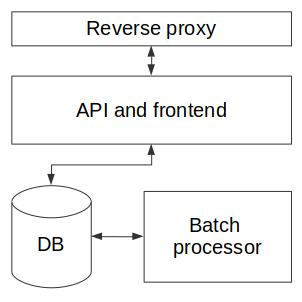
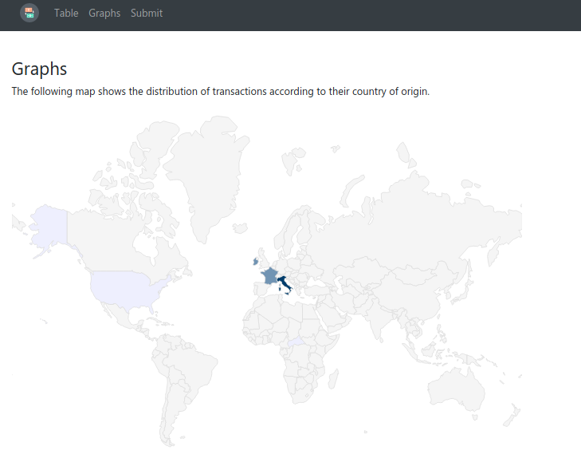

# Market Trade Processor 

This is a study implementation of a web-based currency trading processor.  
It consumes trade messages via an HTTP endpoint, processes those messages and delivers a visualization 
of insights based on the consumed messages.

## Overview

In its current, simplistic configuration, the Trade Processor is composed by a couple of node.js applications.  
The first one runs the web server behind a reverse proxy, exposing the API endpoint and the frontend pages.  
The second one takes care of processing the data in the background, making it available to the frontend via 
the database.  

Each message adding a transaction has a structure similar to the following JSON:

    {"userId": "134256", "currencyFrom": "EUR", "currencyTo": "GBP", "amountSell": 1000, "amountBuy": 747.10, "rate": 0.7471, "timePlaced" : "24-JAN-15 10:27:44", "originatingCountry" : "FR"}

The Trade Processor supports the following API:

    GET /api/txn
        Get all the transactions processed so far [for debug purposes - may not scale well].

    POST /api/txn 
        {"userId": "134256", "currencyFrom": "EUR", .. [see above]}
        Submit a new transaction.

    GET /api/stat/country
        Get JSON object containing the number of transactions for each country of origin of the processed transactions.

    GET /api/stat/currencyfrom
        Get JSON object containing the number of transactions for each origin currency of the processed transactions.

    GET /api/stat/currencyto
        Get JSON object containing the number of transactions for each target currency of the processed transactions.

## Single host performance

This simple architecture deployed on a single `t2.micro` instance of Amazon EC2 allows 
to attain the decent performance of about 130 req/s, as tested with load test tools 
such as [bombardier][bombardier] and [sniper][sniper].

    $ ./bombardier --header="Content-Type: application/json" -c 55 -m POST -f postdata.json -d 1m http://34.240.11.31/api/txn
    Bombarding http://34.240.11.31/api/txn for 1m0s using 55 connections
    [================================================================================================================================] 1m0s
    Done!
    Statistics        Avg      Stdev        Max
    Reqs/sec       131.52      57.39     600.32
    Latency      416.60ms   183.18ms      3.79s
    HTTP codes:
        1xx - 0, 2xx - 7949, 3xx - 0, 4xx - 0, 5xx - 0
        others - 0
    Throughput:    55.85KB/s

## Data visualization

The current implementation of the Trade Processor features a map-based visualization
of the country of origin, and a couple of pie charts showing the percentage of original 
and target currencies of the transactions processed so far.
It would be fairly easy to add other graphs that expose further insights from the 
processed data.

## Notes

Several aspects of this implementation are deliberately simplistic or suboptimal for 
large scale deployments, due to the nature and goals of this project.
In the following we address each of them and hint at possible improvements.  

 * *Database*. The adopted database (SQLite) is clearly not the best choice for a truly
 scalable data-intensive service. SQLite, being an embedded database engine,
 falls short of providing fault tolerance, and its performance are somewhat limited 
 [by design][sqlite], in favor of correctness. 
 Alternative to this would be any distributed RDBMS or NoSQL database.

 * *Data processing pipeline*. A more scalable approach to data processing would involve
 using a set of distributed workers that communicate through a messaging/queue/pub-sub service 
 such as RabbitMQ, Kafka, etc. Clearly this would trade an improved scalability for an increased
 complexity of the system and of its possible failure scenarios.
 
 * *Data warehouse and caching*. Using a separate data warehouse store would ease the load 
 on the main database - at the cost of adding (offline) coordination and managing consistency 
 issues between the two. 
 Similarly, a caching layer (e.g., Redis, memcached) would help improving the frontend performance.

 * *Security*. Clearly, for a currency exchange processor security is paramount.
 In a production-ready version of this application, we would enable HTTPS support for the API
 and, depending on the needs, implement an authentication protocol, possibly based on [tokens][token-auth].
 Moreover, to thwart possible DoS attacks and abuses, we'd have to implement some 
 request throttling - which we did not in the present version 
 (despite the availability of [simple solutions][rate-limit] for express.js) 
 to facilitate the execution of load tests.
 Another obvious security measure is about separating the frontend dashboard server 
 from the API server, which have two different classes of users.

Ultimately, the design choices involved in a similar project depend on the 
goals and the assumptions about performance, fault tolerance and correctness.

## License

WTFPL.

 
 [sqlite]: https://www.sqlite.org/faq.html#q5
 [bombardier]: https://github.com/codesenberg/bombardier
 [sniper]: https://github.com/btfak/sniper
 [token-auth]: https://scotch.io/bar-talk/the-ins-and-outs-of-token-based-authentication
 [rate-limit]: https://www.npmjs.com/package/express-rate-limit